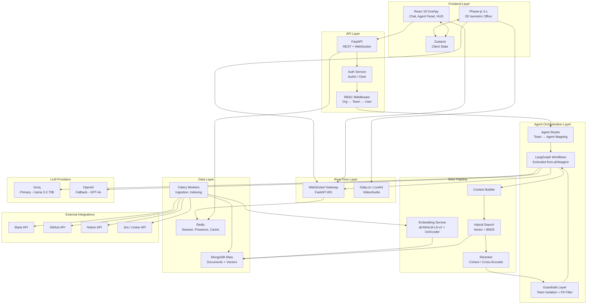
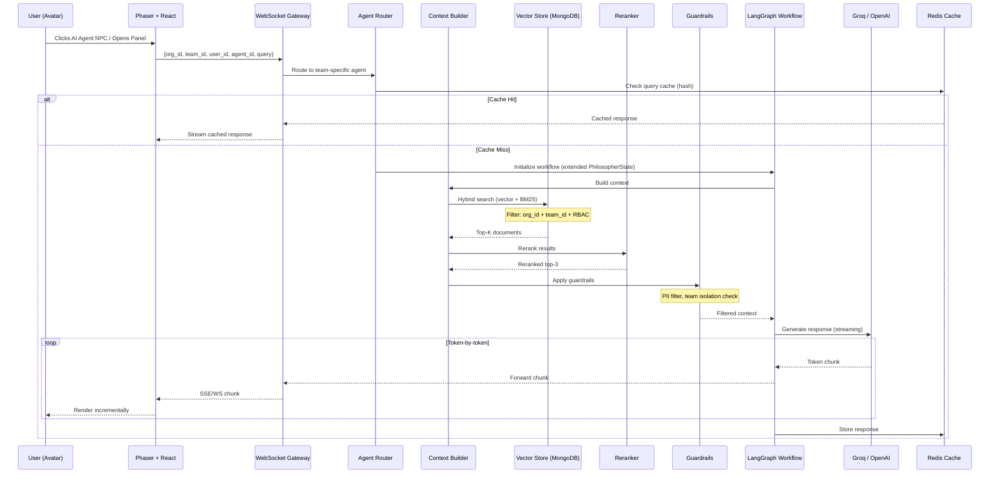
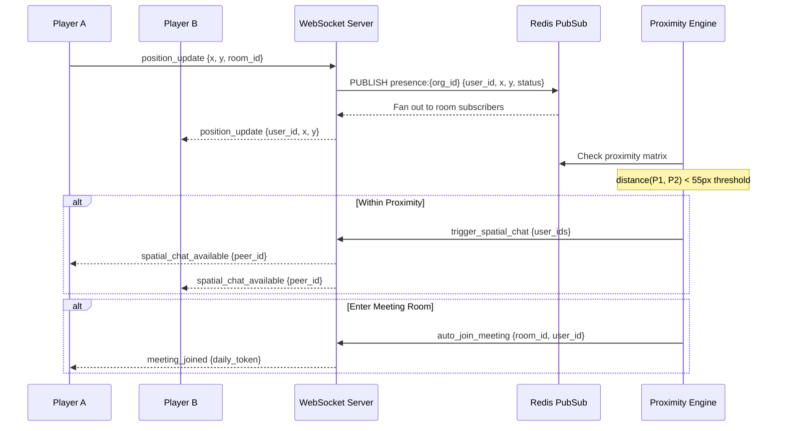

# WorkVerse AI – Technical Architecture & Implementation Blueprint

> **Version**: 1.0 | **Date**: February 16, 2026 | **Status**: Design Review  
> **Audience**: Engineering Leadership, Senior Engineers, Investors

---

## Table of Contents

1. [System Architecture Diagrams](#1-system-architecture-diagrams)
2. [Module-wise Design](#2-module-wise-design)
3. [Technology Stack Justification](./WORKVERSE_TECH_STACK.md)
4. [Database & Data Flow Design](./WORKVERSE_DATA_DESIGN.md)
5. [Proof of Concept Design](./WORKVERSE_POC.md)

---

## 1. System Architecture Diagrams

### 1A. High-Level Architecture Diagram

### 1B. Agent Flow Diagram

### 1C. Real-Time Presence & Proximity Flow

---

## 2. Module-wise Design

### 2.1 Reuse Analysis Summary

| Category | philoagent Provides | Extend | New |
|:---------|:-------------------|:-------|:----|
| Domain Models | `Philosopher`, `PhilosopherFactory`, `Prompt` | Generalize to `Agent`, `AgentFactory` | `Organization`, `Team`, `User`, `Office` |
| LangGraph Workflow | `PhilosopherState`, graph builder, nodes, edges, chains | `AgentState` with multi-tenant context | Role-specific workflows per agent type |
| RAG Pipeline | Embeddings, Splitter, Hybrid Retriever, LTM Creator | Team-scoped retrievers, code embeddings | Ingestion connectors, reranker, guardrails |
| Infrastructure | `MongoClientWrapper`, `MongoIndex`, FastAPI API | Multi-tenant mongo, auth middleware | Redis, Celery, WebSocket rooms, video |
| Frontend | Phaser `Game` scene, `Character`, `DialogueManager` | Multi-player avatars, office zones | React overlay, presence sync, agent panel |

---

### 2.2 Backend Modules

#### Auth & RBAC Module

| Attribute | Detail |
|:----------|:-------|
| **Responsibility** | OAuth 2.0 / SSO login, JWT session management, role-based access control |
| **Interfaces** | `POST /auth/login`, `POST /auth/logout`, `GET /auth/me`, RBAC middleware |
| **Dependencies** | Auth0/Clerk SDK, Redis (session store), MongoDB (user records) |
| **Scalability** | Stateless JWT tokens; Redis for session blacklist; horizontal scaling |
| **philoagent Reuse** | None — philoagent has no auth |
| **New Implementation** | Auth middleware, RBAC decorator, role hierarchy (owner > admin > member > guest) |

#### Organization Management Module

| Attribute | Detail |
|:----------|:-------|
| **Responsibility** | Org CRUD, team management, member invitations, settings |
| **Interfaces** | REST: `/org/*`, `/org/{id}/teams/*`, `/org/{id}/invite` |
| **Dependencies** | MongoDB (org/team/user collections), Auth module |
| **Scalability** | Database-per-org isolation for enterprise tier; shared DB with `org_id` filter for standard |
| **philoagent Reuse** | `MongoClientWrapper` for data access patterns |
| **New Implementation** | Org/Team/User domain models, invitation flow, settings management |

#### Office Engine (Presence + Layout)

| Attribute | Detail |
|:----------|:-------|
| **Responsibility** | Office layout storage, avatar position sync, proximity detection, room management |
| **Interfaces** | `WS /office/presence`, `GET/PUT /office/layout`, Events: `position_update`, `proximity_trigger` |
| **Dependencies** | Redis PubSub (real-time positions), MongoDB (layout persistence), WebSocket Gateway |
| **Scalability** | Redis Cluster for presence; sharded by `org_id`; tick-rate throttled to 10 updates/sec |
| **philoagent Reuse** | Phaser `Character.isPlayerNearby()` proximity logic (client-side) |
| **New Implementation** | Server-side proximity engine, layout editor API, room capacity management |

#### Real-time Service

| Attribute | Detail |
|:----------|:-------|
| **Responsibility** | WebSocket connection management, room-based message routing, presence broadcasting |
| **Interfaces** | WS endpoints: `/ws/presence`, `/ws/chat`, `/ws/agent`; Redis PubSub channels |
| **Dependencies** | FastAPI WebSocket, Redis PubSub, Auth module |
| **Scalability** | Sticky sessions via Redis; horizontal with PubSub fan-out; 10K concurrent target |
| **philoagent Reuse** | `WebSocketApiService` client pattern, WS `/ws/chat` handler pattern |
| **Extend** | Add room-based routing, auth handshake, multi-channel support |

#### Chat Service

| Attribute | Detail |
|:----------|:-------|
| **Responsibility** | DM, team channels, spatial chat, message persistence, thread management |
| **Interfaces** | `POST /chat/message`, `GET /chat/history`, `WS /ws/chat/{channel_id}` |
| **Dependencies** | MongoDB (messages collection), Redis (unread counts), Real-time Service |
| **Scalability** | Capped collections for spatial chat; TTL indexes for ephemeral messages |
| **philoagent Reuse** | None directly — philoagent chat is agent-only |
| **New Implementation** | Channel model, thread model, message search, read receipts |

#### Meeting Service

| Attribute | Detail |
|:----------|:-------|
| **Responsibility** | Meeting creation, auto-join on room entry, video token management, AI notes |
| **Interfaces** | `POST /meeting/create`, `POST /meeting/{id}/join`, Webhook: Daily.co events |
| **Dependencies** | Daily.co/LiveKit SDK, Office Engine (room detection), LLM (meeting summary) |
| **Scalability** | Daily.co handles media; our service is stateless token generator |
| **philoagent Reuse** | None |
| **New Implementation** | Meeting lifecycle, recording hooks, AI summary pipeline |

#### Agent Gateway

| Attribute | Detail |
|:----------|:-------|
| **Responsibility** | Route queries to correct team agent, manage agent registry, enforce rate limits |
| **Interfaces** | `POST /agent/query`, `WS /ws/agent/stream`, `GET /agent/registry` |
| **Dependencies** | Agent Registry, LangGraph, Auth/RBAC, Redis (rate limiting + caching) |
| **Scalability** | Stateless routing; cache hot queries in Redis with 5-min TTL |
| **philoagent Reuse** | `/chat` and `/ws/chat` endpoint patterns from `api.py` |
| **Extend** | Add `org_id`/`team_id` routing, agent selection, rate limiting |

#### RAG Service

| Attribute | Detail |
|:----------|:-------|
| **Responsibility** | Orchestrate retrieval: embed query → hybrid search → rerank → guardrails |
| **Interfaces** | Internal: `retrieve(query, org_id, team_id, filters)` → `list[Document]` |
| **Dependencies** | Embedding Service, MongoDB Atlas Vector Search, Reranker, Guardrails |
| **Scalability** | Async retrieval; warm embedding model in memory; connection pooling |
| **philoagent Reuse** | `LongTermMemoryRetriever`, `get_retriever()`, `get_hybrid_search_retriever()` |
| **Extend** | Add `org_id`/`team_id` namespace filtering, code embedding model, reranking step |

#### Embedding Service

| Attribute | Detail |
|:----------|:-------|
| **Responsibility** | Generate embeddings for text and code chunks |
| **Interfaces** | Internal: `embed(text) → vector`, `embed_batch(texts) → vectors` |
| **Dependencies** | HuggingFace models (all-MiniLM-L6-v2, unixcoder-base) |
| **Scalability** | GPU workers for batch; CPU for real-time queries; model warm-up on startup |
| **philoagent Reuse** | `get_embedding_model()` from `embeddings.py` |
| **Extend** | Add code embedding model, batch processing, model registry |

#### Data Ingestion Service

| Attribute | Detail |
|:----------|:-------|
| **Responsibility** | Connect to external sources, extract data, chunk, embed, index |
| **Interfaces** | `POST /ingest/connect`, `POST /ingest/sync`, Celery tasks |
| **Dependencies** | Celery + Redis (queue), Slack/GitHub/Notion APIs, Embedding Service, MongoDB |
| **Scalability** | Horizontal Celery workers; webhook-driven incremental sync; dead-letter queue |
| **philoagent Reuse** | `LongTermMemoryCreator`, `get_splitter()`, `deduplicate_documents()` |
| **Extend** | Replace Wikipedia extractor with Slack/GitHub/Notion connectors; add incremental sync |

#### Analytics Engine

| Attribute | Detail |
|:----------|:-------|
| **Responsibility** | Team health metrics, AI usage stats, productivity insights |
| **Interfaces** | `GET /analytics/team/{id}`, `GET /analytics/agent-usage` |
| **Dependencies** | MongoDB (aggregation pipelines), Redis (counters) |
| **philoagent Reuse** | None |
| **New Implementation** | Metric collectors, aggregation jobs, dashboard API |

#### Gamification Engine

| Attribute | Detail |
|:----------|:-------|
| **Responsibility** | XP tracking, badges, streaks, leaderboards |
| **Interfaces** | `GET /gamification/profile`, `GET /gamification/leaderboard` |
| **Dependencies** | MongoDB (achievement collection), Event bus |
| **philoagent Reuse** | None |
| **New Implementation** | Event-driven achievement system, XP calculator, streak tracker |

#### Notification System

| Attribute | Detail |
|:----------|:-------|
| **Responsibility** | In-app notifications, proactive agent alerts, email digests |
| **Interfaces** | `WS /ws/notifications`, `GET /notifications`, Internal event bus |
| **Dependencies** | Redis PubSub, MongoDB (notification log), Email service |
| **philoagent Reuse** | None |
| **New Implementation** | Notification router, preference management, delivery channels |

---

### 2.3 AI Layer Modules

#### Agent Registry

| Attribute | Detail |
|:----------|:-------|
| **Responsibility** | Store agent definitions (name, role, data sources, prompt config, team binding) |
| **Interfaces** | Internal: `get_agent(team_id) → AgentConfig` |
| **philoagent Reuse** | `PhilosopherFactory` pattern, `PHILOSOPHER_NAMES/STYLES/PERSPECTIVES` dicts |
| **Extend** | Replace static dicts with MongoDB-backed registry; support dynamic agent creation |

#### Agent Router

| Attribute | Detail |
|:----------|:-------|
| **Responsibility** | Map incoming query to correct agent based on `org_id` + `team_id` |
| **Interfaces** | Internal: `route(org_id, team_id, query) → AgentWorkflow` |
| **philoagent Reuse** | `PhilosopherFactory.get_philosopher()` dispatch pattern |
| **Extend** | Multi-tenant routing with team isolation; fallback agent selection |

#### Context Builder

| Attribute | Detail |
|:----------|:-------|
| **Responsibility** | Assemble full context: RAG results + conversation history + agent persona |
| **Interfaces** | Internal: `build_context(query, state) → EnrichedContext` |
| **philoagent Reuse** | `conversation_node` pattern that assembles `philosopher_context` + `summary` |
| **Extend** | Add team-scoped RAG retrieval, user role filtering, context window management |

#### Retrieval Engine

| Attribute | Detail |
|:----------|:-------|
| **Responsibility** | Execute hybrid search with team-scoped vector collections |
| **Interfaces** | Internal: `retrieve(query, namespace) → list[Document]` |
| **philoagent Reuse** | `MongoDBAtlasHybridSearchRetriever`, `get_hybrid_search_retriever()` |
| **Extend** | Parameterize namespace per `org.team`; add `pre_filter` for RBAC |

#### Reranker

| Attribute | Detail |
|:----------|:-------|
| **Responsibility** | Re-score retrieved documents for relevance |
| **Interfaces** | Internal: `rerank(query, docs) → list[ScoredDocument]` |
| **philoagent Reuse** | None — philoagent uses raw retriever results |
| **New Implementation** | Cohere Rerank API integration or local cross-encoder |

#### Guardrails Layer

| Attribute | Detail |
|:----------|:-------|
| **Responsibility** | Enforce data isolation, PII filtering, content safety |
| **Interfaces** | Internal: `apply_guardrails(context, user) → FilteredContext` |
| **philoagent Reuse** | None |
| **New Implementation** | Team data boundary check, PII regex filter, content moderation |

#### Memory Store

| Attribute | Detail |
|:----------|:-------|
| **Responsibility** | Short-term (conversation) and long-term (knowledge) memory per agent-user pair |
| **Interfaces** | Internal: LangGraph checkpoint + summary management |
| **philoagent Reuse** | `AsyncMongoDBSaver` checkpointing, `summarize_conversation_node`, `should_summarize_conversation` edge |
| **Extend** | Scope checkpoints by `org_id:team_id:user_id:agent_id`; per-user memory isolation |

#### Proactive Insights Engine

| Attribute | Detail |
|:----------|:-------|
| **Responsibility** | Background analysis of team data to surface proactive alerts |
| **Interfaces** | Celery periodic tasks → Notification System |
| **philoagent Reuse** | None |
| **New Implementation** | Scheduled analysis jobs, trend detection, alert generation |

---

### 2.4 Frontend Modules

#### Phaser Game Layer

| Attribute | Detail |
|:----------|:-------|
| **Responsibility** | 2D isometric office rendering, avatar movement, collision, NPC agents |
| **philoagent Reuse** | `Game` scene (tilemap, layers, camera, controls), `Character` class (sprites, animations, proximity detection, roaming AI) |
| **Extend** | Multi-player avatar sync, office zones, room boundaries, AI agent stations |
| **New** | Office layout editor, theme engine, interactive objects |

#### React Overlay Layer

| Attribute | Detail |
|:----------|:-------|
| **Responsibility** | Chat panels, agent interaction panel, meeting controls, notifications, HUD |
| **philoagent Reuse** | `DialogueBox`, `DialogueManager` patterns for agent interaction |
| **New Implementation** | Full React component tree: ChatPanel, AgentConsultPanel, MeetingPanel, NotificationCenter, MiniMap, StatusBar |

#### State Management (Zustand)

| Attribute | Detail |
|:----------|:-------|
| **Responsibility** | Unified client state across Phaser and React |
| **philoagent Reuse** | None — philoagent uses Phaser-internal state only |
| **New Implementation** | Zustand stores: `usePresenceStore`, `useChatStore`, `useAgentStore`, `useMeetingStore`, `useOfficeStore` |

#### Agent Interaction Panel

| Attribute | Detail |
|:----------|:-------|
| **Responsibility** | Chat-style agent query UI with streaming response rendering |
| **philoagent Reuse** | `WebSocketApiService` (connection management, streaming callbacks, chunk handling) |
| **Extend** | Add agent selection, conversation history, citation rendering, feedback buttons |

#### Streaming Response Renderer

| Attribute | Detail |
|:----------|:-------|
| **Responsibility** | Token-by-token rendering with markdown support |
| **philoagent Reuse** | `WebSocketApiService.handleMessage()` chunk protocol |
| **Extend** | Add markdown rendering, code syntax highlighting, citation links |

#### Presence Sync Engine

| Attribute | Detail |
|:----------|:-------|
| **Responsibility** | Sync player positions between clients via WebSocket |
| **philoagent Reuse** | `Character.update()` position tracking pattern |
| **New Implementation** | WebSocket presence channel, interpolation, dead reckoning, status indicators |
